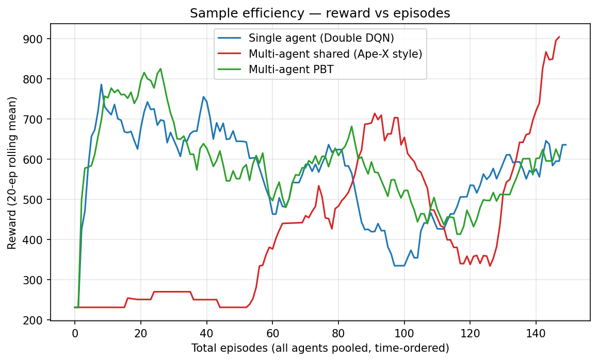
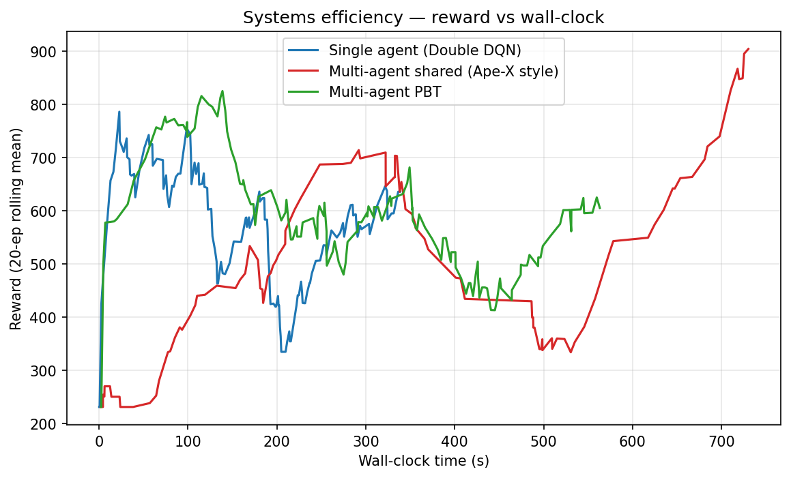
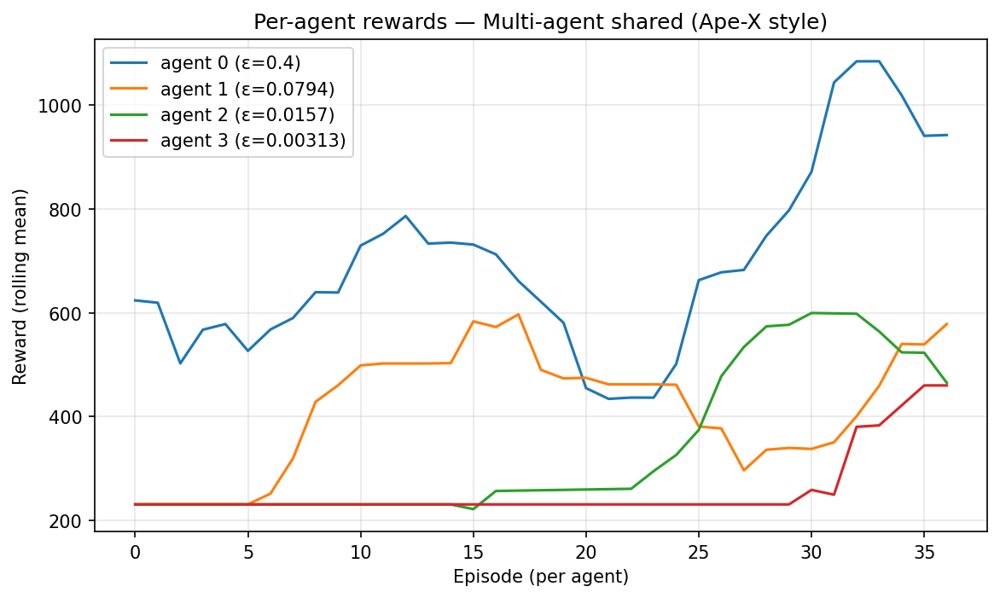
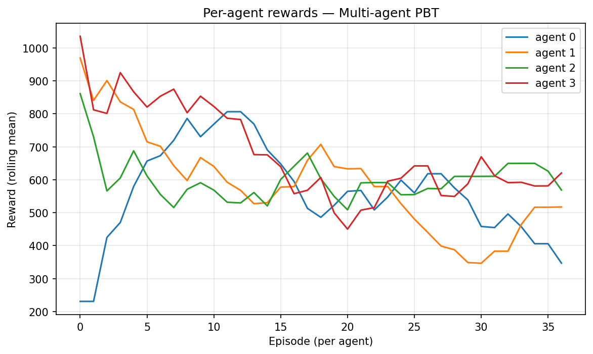
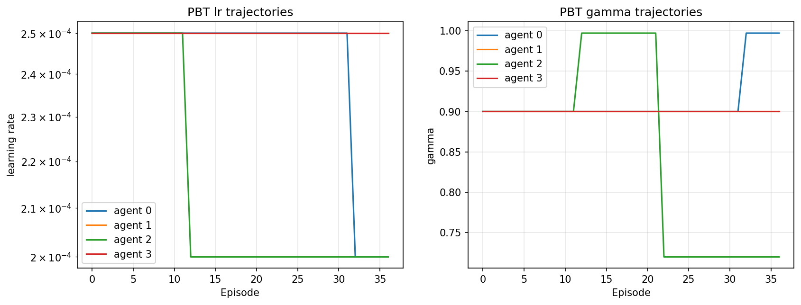
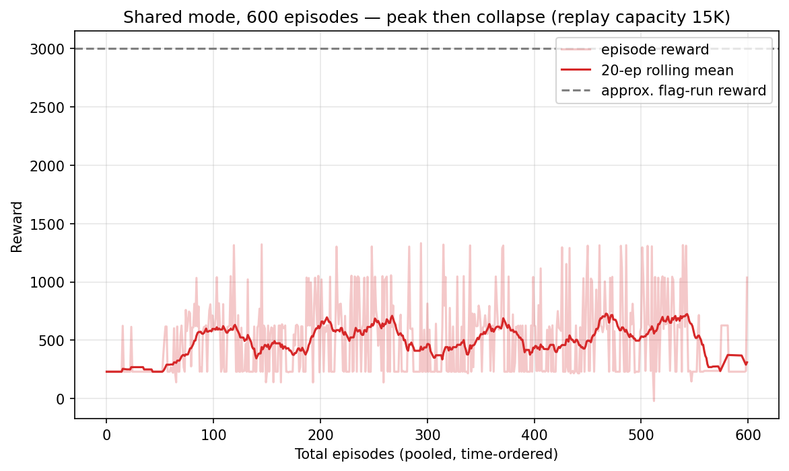
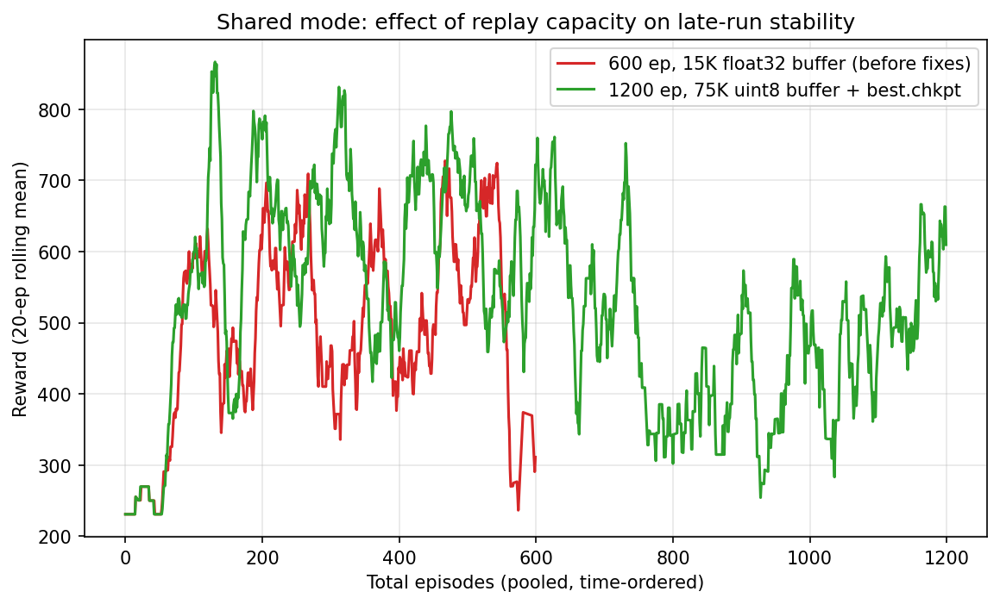

# MadMario — Multi-Agent v2 Evaluation

Comparison of the three training modes on `SuperMarioBros-1-1-v0`, CPU-only
(12 cores), seed 42, replay capacity 10 K, burnin 200. Single-agent and PBT
workers use fast ε-decay (0.9995/step) so learning is visible at this budget;
shared-mode actors use the fixed ε ladder by design.

W&B mirror: <https://wandb.ai/ohsono-private/madmario-eval> (run `o34fu8t2`).

## Setup

| Mode | Command (abridged) | Episodes | Processes |
|---|---|---|---|
| single | `train.py train --episodes 150 --eps-decay 0.9995` | 150 | 1 |
| shared | `train.py train --multi-agent --ma-mode shared --num-agents 4` | 148 (4×37) | 1 learner + 4 actors |
| pbt | `train.py train --multi-agent --ma-mode pbt --num-agents 4 --pbt-interval 10 --eps-decay 0.9995` | 148 (4×37) | 4 full agents |

## Results

| mode | episodes | mean reward | **final 20-ep mean** | wall (s) |
|---|---|---|---|---|
| single | 150 | 575.2 | 635.6 | 339 |
| **shared** | 148 | 465.0 | **903.9** | 730 |
| pbt | 148 | 584.3 | 605.0 | 563 |

(Random-policy baseline on this level is ≈230. No flag-gets at this budget —
finishing 1-1 typically needs ≳10K episodes.)





## Interpretation

**Shared (Ape-X style) ends far ahead and is still climbing.** Its pooled
curve starts at the random baseline (~230) and lags for the first ~50
episodes — expected, since the curve averages *all* actors, including the
permanent ε=0.4 explorer, and the learner needs to fill the shared buffer
before its 15,005 gradient steps start paying off. From episode ~130 it
surges past both baselines to a 903.9 final mean, the strongest policy of the
three, with no sign of plateau at cutoff. The per-actor plot shows the
mechanism: the near-greedy actors (ε=0.016, ε=0.003) track the learner's
improving policy, while the explorer keeps feeding diverse transitions.



**Single agent learns fastest initially, then oscillates.** With fast ε-decay
it exploits early (peak ~780 by episode 10) but churns between 350–650
afterwards — the classic instability of one annealed exploration schedule on
one data stream.

**PBT demonstrates its mechanism at this budget rather than a score win.**
Three exploit events fired, each correctly targeting the bottom-quartile
agent and copying a top-quartile member's weights + perturbed
hyperparameters (γ explored to 0.997 and 0.72; lr to 2.0e-4). The
hyperparameter trajectories below are the real deliverable — PBT's payoff
grows with budget, and 37 episodes/agent only allows 3 selection rounds.





## Caveats

- Single seed, ~150 episodes/mode, CPU-only: these measure **early learning
  dynamics**, not final performance (Henderson et al. 2018 — see
  [THEORY.md](THEORY.md) §6). Treat rankings as indicative.
- Wall-clock is not matched across modes (339–730 s); the shared learner did
  ~3× the gradient steps of the single agent in ~2× the time on the same data
  budget — its advantage compounds on the wall-clock axis at larger scale.
- Shared-mode "mean reward" (465.0) is structurally depressed by the
  high-ε actors; the final 20-ep mean (pooled, time-ordered) and the
  near-greedy actors' curves are the fair policy-quality measures.

## Follow-up: 600-episode shared run — did Mario get the flag?

**No flags in 600 episodes** (4 actors × 150, 110,336 transitions, 36,778
gradient steps, 57 min). Best single episode reached reward 1331 — roughly
the mid-level pipe section; a flag run pays ≈3000.

More interesting than the missed flag is the **shape** of the curve: the
20-episode mean peaked at 727 around pooled episode 467, oscillated, then
**collapsed to ~311 over the final 60 episodes** — below where the
148-episode run had ended (904).



This is a textbook instability, and the likely causes are visible in the
configuration:

1. **Replay buffer far smaller than the data stream.** Capacity was 15 K
   while the run generated 110 K transitions — by the end, the buffer held
   only the most recent ~14 % of experience, almost all of it produced by
   near-greedy actors executing the *current* policy. Early diverse
   exploration data was evicted, the data distribution narrowed, and the
   value function drifted (catastrophic forgetting / off-policy feedback
   loop). Ape-X counters exactly this with replay capacities in the millions
   plus prioritized sampling.
2. **No best-checkpoint tracking.** The learner saved its weights once at
   run end — i.e., the *post-collapse* policy. The episode-467 policy was
   never persisted.
3. **Short horizon (γ=0.9)** discounts the flag reward to near-zero from
   more than ~50 steps away; reaching it at this budget would mostly be luck.

**Concrete fixes, in order of expected impact:** (a) store frames as `uint8`
to fit a 100 K+ buffer in RAM (8× smaller than float32), (b) save a
`best.chkpt` whenever the pooled 20-episode mean makes a new high,
(c) prioritized experience replay, (d) γ 0.9 → 0.99 with a longer budget.
Flag-get on 1-1 typically needs ~10 K episodes even for well-tuned DQN —
the original tutorial trained for 40 K.

### Fixes (a)+(b) verified: 1200-episode rerun

Fixes (a) and (b) were implemented and the run relaunched at double budget
(1200 episodes, 75 K uint8 buffer — the buffer now retains ~36 % of the
209 K-transition stream vs 14 % before):

| | 600 ep (15 K float32) | 1200 ep (75 K uint8 + best.chkpt) |
|---|---|---|
| peak 20-ep mean | 727 | **866** |
| final 20-ep mean | **311 (collapse)** | 610 (stable) |
| max episode reward | 1331 | **1903** |
| best policy preserved? | no (end-only save) | yes — `best.chkpt` at the peak |
| greedy eval of saved chkpt | 231 (post-collapse) | **826 mean / 1321 max** (10 eps) |
| flag-gets | 0 | 0 |



The late-run collapse is gone — the curve sags from its peak but holds
around 500–610 instead of falling to baseline, confirming replay eviction
as the dominant instability. Still no flag: greedy playback of the best
policy consistently reaches the ~x≈1900 region (reward 1321–1903) and dies
in the second half of the level. Remaining gap to the flag (x≈3161) is a
*horizon* problem — γ=0.9 makes rewards >50 steps ahead nearly invisible —
plus budget: fixes (c) prioritized replay and (d) γ=0.99 with a multi-
thousand-episode run are the next lever.

## Reproduce

```bash
python train.py train --episodes 150 --seed 42 --burnin 200 \
    --memory-size 10000 --eps-decay 0.9995 --save-dir runs/single
python train.py train --multi-agent --ma-mode shared --num-agents 4 \
    --episodes 150 --seed 42 --burnin 200 --memory-size 10000 --save-dir runs/shared
python train.py train --multi-agent --ma-mode pbt --num-agents 4 --pbt-interval 10 \
    --episodes 150 --seed 42 --burnin 200 --memory-size 10000 \
    --eps-decay 0.9995 --save-dir runs/pbt
python plot_compare.py runs/single runs/shared runs/pbt \
    --out docs/plots --wandb-project madmario-eval
```
